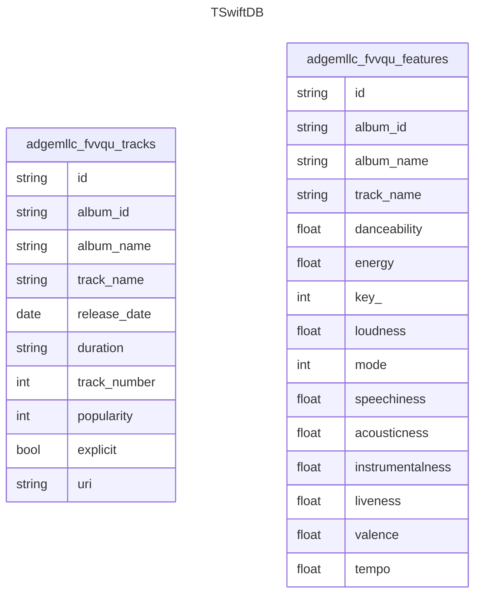

# Taylor Swift - The Myth, the Legend

Quantitative and qualitative statistics of Taylor Swift's songs

## Entity-Relationship Diagram

## Data Dictionary

| Field | Description |
| ----- | ----------- |
| id | The Spotify ID for the track. |
| danceability | Danceability describes how suitable a track is for dancing based on a combination of musical elements including tempo, rhythm stability, beat strength, and overall regularity. A value of 0.0 is least danceable and 1.0 is most danceable. |
| energy | Energy is a measure from 0.0 to 1.0 and represents a perceptual measure of intensity and activity. Typically, energetic tracks feel fast, loud, and noisy. |
| mode | Mode indicates the modality (major or minor) of a track, the type of scale from which its melodic content is derived. Major is represented by 1 and minor is 0. |
| speechiness | Speechiness detects the presence of spoken words in a track. The more exclusively speech-like the recording (e.g. talk show, audio book, poetry), the closer to 1.0 the attribute value. |
| acousticness  | A confidence measure from 0.0 to 1.0 of whether the track is acoustic. 1.0 represents high confidence the track is acoustic. Range: 0 - 1 |00
| key  | The key the track is in. Integers map to pitches using standard Pitch Class notation. E.g. 0 = C, 1 = C♯/D♭, 2 = D, and so on. If no key was detected, the value is -1. Range: -1 - 11 |
| instrumentalness  | Predicts whether a track contains no vocals. The closer the instrumentalness value is to 1.0, the greater likelihood the track contains no vocal content. Values above 0.5 are intended to represent instrumental tracks, but confidence is higher as the value approaches 1.0.
liveness  | Detects the presence of an audience in the recording. Higher liveness values represent an increased probability that the track was performed live. A value above 0.8 provides strong likelihood that the track is live. |
| tempo | The overall estimated tempo of a track in beats per minute (BPM). In musical terminology, tempo is the speed or pace of a given piece and derives directly from the average beat duration. Example: 118.211 |
| valence | A measure from 0.0 to 1.0 describing the musical positiveness conveyed by a track. Tracks with high valence sound more positive (e.g. happy, cheerful, euphoric), while tracks with low valence sound more negative (e.g. sad, depressed, angry). |
| album id, album_name | corresponding to the track's album |
| id, name | corresponding to the track |
| release_date | The date on which the track was released |
| duration | The duration of the track in hh:mm:ss format |
| track_number | The number of the track in the album. Like the famous track 5s. |
| popularity | A metric ranging from 0 to 100 to signify the popularity of the song. |
| explicit | A true/false flag for explicitness. |
| uri | The Spotify URI for the track. |
